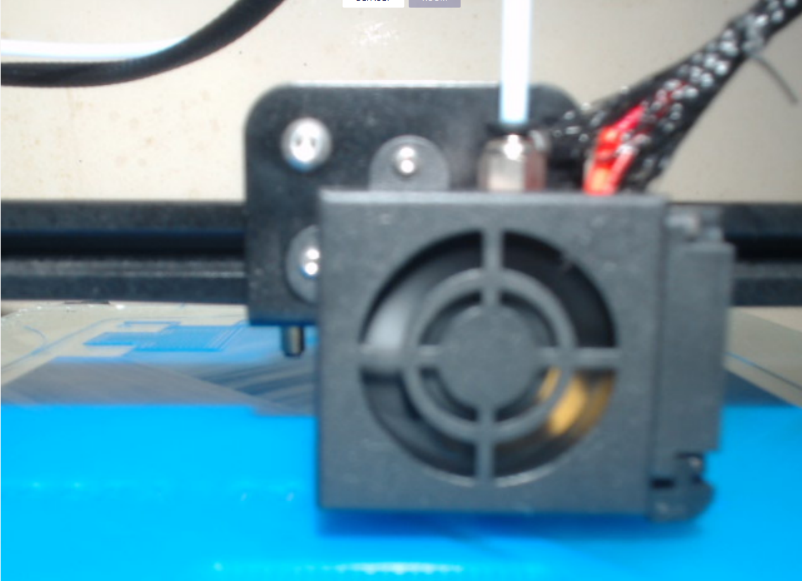
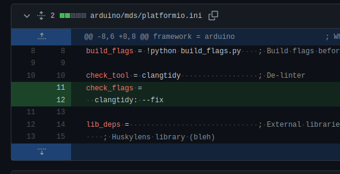
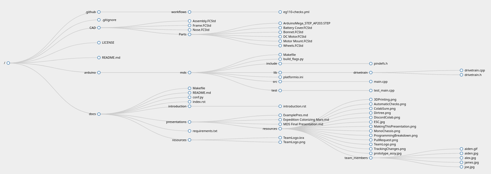
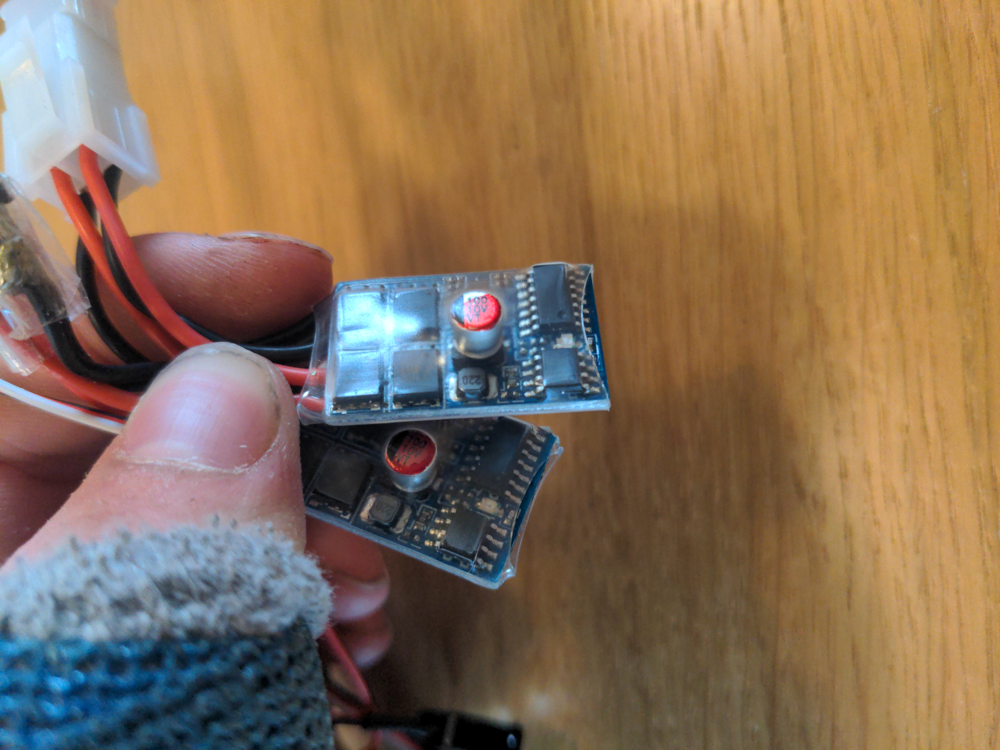
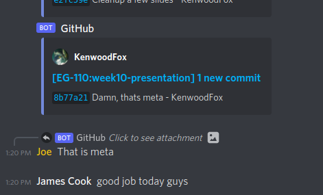

---
title:
 - A-B Transport MDS Project Overview
subtitle:
 - Version &hash
author:
 - Joe
 - Alex
 - James
 - Aiden
institute:
 - SNHU/CETA, EG-110
titlegraphic: ../../resources/TeamLogo.png
theme: Berlin
navigation: frame
date: "Build Date: &date"
aspectratio: 169
logo: resources/TeamLogo.png
fontsize: 8pt
---

# Introduction

## Audience and Purpose

### Audience Characteristics

 - Non-technical people
 - Average martians doing average jobs
 - Might know a little about the basics but not about the advanced features (huskylens)

### Purpose

 - Explain the design problem
 - Design goals
 - Concepts we're considering

## Meet the A-B Transport Team!

::: columns

:::: {.column width=20%}

{ width=90 }  
Alex

::::

:::: {.column width=20%}

{ width=90 }  
James

::::

:::: {.column width=20%}

{ width=90 }  
Joe

::::

:::: {.column width=20%}

{ width=90 }  
Aiden

::::

:::

# Outline

## Project Statement

### Project Statement

 - How can we successfully create a reliable shipping and transport solution that can be relied on by martians?

## Key Design Requirements

### Functional
 - Transport as much as possible.
   - Intentionally vague, strive to make every engineering choice to improve weight capacity.
 - Be as efficient as possible.
 - Prioritize speed and reliability.
 - Prioritize autonomy.

### Physical Requirements

 - Have a sleek, __stackable__ profile. This means our unit should utilize a bounding box space and be as efficient
in its use of standby space as possible.

### Performance Requirements

 - Transport at least 2.5lb for no less than 20m.
 - Perform long distance autonomous routes and have a user operated cycle start/stop sequence.

## Concepts and Selection

::: columns

:::: {.column}

### Mono-chassis

::::

:::: {.column}

### Huskylens

Todo

::::

:::

# Fabrication

## Fabrication Summary

 - We collected COTS robot parts from scrap/old robots.
 - We 3D printed components
 - We machined brackets and misc parts
 - We combined motors and COTS gearbox components into larger components

## 3D Printing

{ height=60% }

Us 3D printing our chassis

## 3D Printing

{ height=60% }

An early assembly of the prototype

## Software

Like hardware, software must be developed in a similar process, prototyping, testing, refining.

::: columns

:::: {.column}

### Pull Requests

{ height=60% }

A pull request is a way to track a feature, and confirm it works before merging it in.

::::

:::: {.column}

### Managing Diffs

{ height=45% }

Each tiny change can be recorded and checked by other team members.

::::

:::

## Automatic Software checks

::: columns

:::: {.column}

{ height=80% }

::::

:::: {.column}

 - By using CI/CD we can automatically check every team member's software contributing before even uploading changes to the arduino firmware.
 - Artifacts can also be downloaded, including things like presentations, arduino **binaries** and other information.

::::

:::

## Software breakdown

In the end we had a robust, easy to navigate software base.

### Final Software breakdown

{ height=10% }

{ height=50% }

## Electronics

We used several major electrical components such as a main breakout protoboard and proper ESCs.

::: columns

:::: {.column}

### ESC

{ height=80% }

::::

:::: {.column}

### Protoboard

{ height=80% }

::::

:::

# Collaboration

## Collaboration on Discord

We mainly used discord to facilitate collaboration and as a central place to store photos and make notes.

::: columns

:::: {.column}

{ height=80% }

::::

:::: {.column}

{ height=80% }

::::

:::

# Conclusion

## Final Prototype

Todo

## Lessons Learned

 - Huskylens library
   - The library was clunky, and poorly maintained. We ended up submitting an issue or two and a pull request on their upstream repo.
 - 3D printing is slow!
   - In total, the 3D printer ran for **55 hours** and used **940** grams in total producing our final prototype, this took forever!
 - For this application, the huskylens performed **worse** than a properly tuned line tracker
   - The huskylens performed worse, and was much harder to tune PID for, than a dedicated line following robot using IR and tape.

# Questions

## Questions?

 - What
 - Why
 - Who
 - When
 - Where

# Backup Slides

## Backup slides like this one

Beep beep
(Get it? im backing up)

## How was this presentation made?

This entire presentation was written in markdown, an industry standard for documentation.

This allows us to write cleanly, with no formatting, and convert the result into any
form of documentation we want, **epub**, **pdf**, **slideshow**, etc.

{ height=40% }
